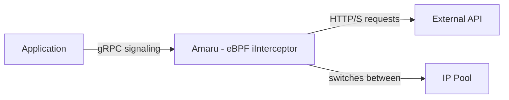
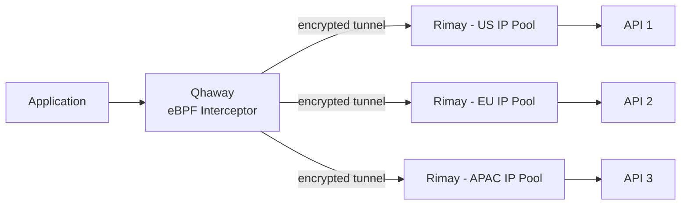

# Amaru

> Adaptive eBPF-powered rate limit proxy with intelligent IP rotation

## Overview

Amaru is an intelligent proxy service that automatically detects and adapts to API rate limits through eBPF technology. It sits on the same node as your application and intercepts outgoing API requests, dynamically managing traffic to prevent rate limiting issues.

## Key Features

- **Pattern-Based Rate Limit Handling**: Acts on application-provided patterns to identify requests requiring IP rotation
- **Traffic Shaping**: Adaptively slows down requests to stay under rate limits
- **IP Address Rotation**: Automatically switches between IP addresses from a configured pool when rate limits are reached
- **Pattern-Based Monitoring**: Uses regex patterns to identify and manage specific endpoints or request types
- **Low-Overhead Design**: Leverages eBPF for kernel-level traffic interception with minimal performance impact
- **Simple Integration**: Go client library for direct communication with the proxy

## How It Works

1. Your application sends requests through the Amaru proxy
2. When application detects rate limiting, it notifies Amaru with specific k/v patterns to match
2. Applications notify Amaru via gRPC when they detect rate limiting
3. Applications provide k/v patterns (e.g., "header: unique-id" or "url: http://*.github.com") to identify affected requests
4. Amaru adaptively manages request rates and rotates IP addresses as needed
5. Configuration happens through a simple API or config files

## Technical Components

- **eBPF Programs**: Kernel-level packet interception and processing
- **Userspace Agent**: Manages configuration, IP pools, and communication
- **Redis/etcd**: Stores configuration, patterns, and state
- **Go Client Library**: For applications to report rate limiting events

## Use Cases

- API integration engines requiring high throughput to rate-limited APIs
- Automated security tools making frequent API requests
- Web scrapers that need to respect rate limits while maximizing throughput
- Any application needing to work around IP-based rate limiting

## Project Status

Amaru is currently in early development. Contributions and feedback are welcome!

## Roadmap Evolution: Distributed Architecture

Future versions of Amaru will evolve toward a distributed architecture inspired by tunneling projects like Pangolin, consisting of:

### Listeners (Qhaway - eBPF Interceptors)
- Run locally on application nodes
- Intercept traffic using eBPF
- Match patterns from applications
- Route traffic to appropriate Speakers via tunnels
- Maintain lightweight, minimal local footprint

### Speakers (Rimay - Tunnel Endpoints)
- Deploy globally across different regions
- Manage regional IP pools
- Handle actual external API communication
- Report health/performance metrics back
- Scale independently based on regional needs

This architecture provides several advantages:
- Global distribution reduces latency to target APIs
- Access to regionally diverse IP pools
- Enhanced resilience through redundancy
- Ability to route around regional rate limits or blocks
- Scalability by adding Speakers where demand is highest

